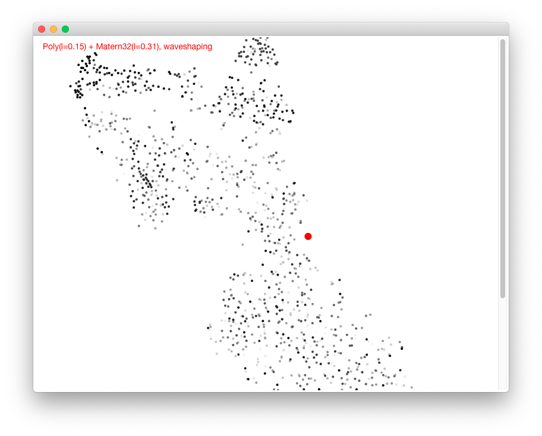

# Gaussian Process Sound Synthesis

Gaussian Process Sound Synthesis is controlled by choosing a kernel. The 
kernel is used to compute a wavetable or waveshaping function. The wavetable
and the waveshaping function can then be used for 
[wavetable synthesis](https://en.wikipedia.org/wiki/Wavetable_synthesis) or 
[waveshaping](https://en.wikipedia.org/wiki/Waveshaper). More information can 
be found [here](https://www.mdpi.com/2076-3417/10/5/1781).

## Simple Interface

```commandline
python -m ui.simple_ui.py
```
Choose a kernel from the list of options, a lenghtscale and hit "Play".


## TSNE Interface
The TSNE user interface groups the sounds generated with Gaussian Process
Synthesis by their similarity. Each sound is represented by a dot. When the 
user clicks on one of the dots, the corresponding sound is played.



### Running the TSNE Interface

First, you generate the wavetables (which will take some time):
```commandline
python -m gpsynth.make_wavetables.py
```

Then, you start the interface_server with the ```--dir``` option pointing to 
the directory you have just created.
```commandline
python -m ui.tsne_ui_server.py --dir path/to/DATE-TIME_multiexport
```
The first time you run, it will analyze all the sounds. This will take some 
time. The results are cached. So you will have to wait only once.

Now you can run the user interface:
```commandline
python -m ui.tsne_ui_clinet.py
```

### Integrating sound programming languages

The TSNE user interface sends Open Sound Control (OSC) messages that inform the
receiving application, which sound was selected. A program written in a 
sound programming language, such as pureData, Max/MSP or SuperCollider can
load the corresponding wavetable from the directory and synthesize sounds in
real-time. The IP address and the port used for OSC communication can be 
configured. Furthermore the ``--quiet`` option prevents the user interface from
generating sound.
```commandline
python -m ui.tsne_ui_client.py --ip 127.0.0.1 --port 5005 --quiet
```

When the user clicks on a dot, the user interface sends an OSC message. It 
consists of the OSC path ``/loadtable`` followed by the filename of the
wavetable, e.g. ``Exponential_l000(plus)OU_l008_n00.wav``. It is the 
responsibility of the receiver to read the wavetable and use it for synthesis.
The "maxmsp" directory contains a Max/MSP implementation. 

## Development

Gaussian Process Synthesis is implemented in ``synthesizer.py``.